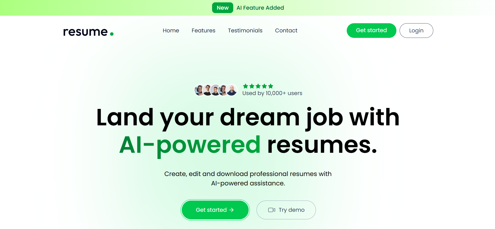
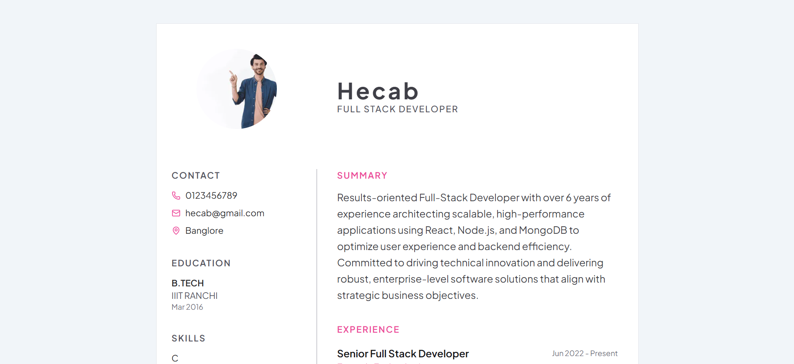
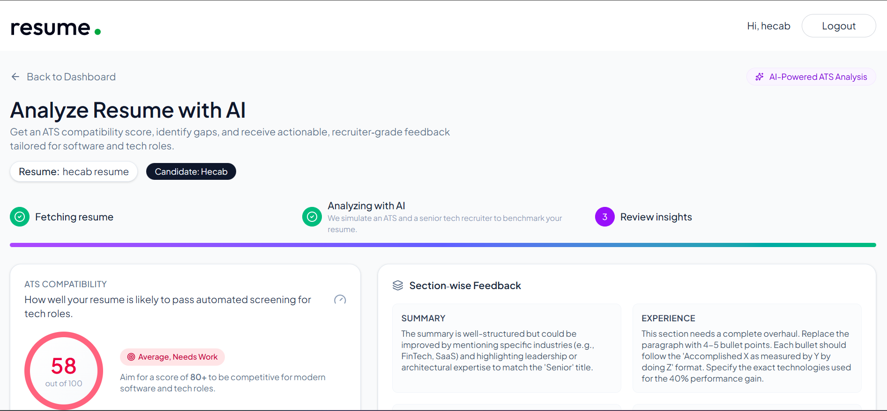

# 🚀 AI-Powered Resume Builder using MERN + Gemini + Tailwind UI

## ⭐ About the Project

**Resume Builder** is a modern web application that helps users create
professional resumes quickly. It uses **Gemini AI** (via
OpenAI-compatible API) for content generation and analysis, including:

-   Resume Summary
-   Skills & Experience Bullets
-   Project Descriptions
-   **ATS Resume Analysis** (score, strengths, weaknesses, missing
    keywords, section feedback)

The app is built with **React + Tailwind CSS** and supports AI features,
CRUD, live preview, and PDF export.

------------------------------------------------------------------------

## ✨ Features

### 🎨 Frontend

-   UI built with **React 19 + Vite + Tailwind CSS v4**
-   Multiple resume templates
-   Live resume preview
-   Responsive layout

### 🤖 AI Integration

-   Gemini AI (via OpenAI-compatible API)
-   Auto-generate Resume Summary
-   AI-generated Skills & Experience
-   Upload existing PDF resume and extract content
-   **Analyze Resume with AI** --- ATS score, strengths, weaknesses,
    missing keywords, section-wise feedback

### 🟩 Backend + Database

-   Node.js + Express
-   MongoDB (user & resume data)
-   JWT auth
-   CRUD for resumes

### 📤 Extra Features

-   Export to PDF
-   Edit & update resumes
-   Save & manage multiple resumes
-   Public/private resume sharing

------------------------------------------------------------------------

## 🧰 Tech Stack

| Layer     | Technologies |
|-----------|--------------|
| Frontend  | React 19, Vite, Tailwind CSS, Redux, React Router, Lucide Icons |
| Backend   | Node.js, Express.js |
| Database  | MongoDB (Mongoose) |
| AI        | Gemini (OpenAI-compatible API) |
| Tools     | Git, GitHub |


------------------------------------------------------------------------

## 🧱 Architecture

Frontend (React + Vite + Tailwind)\
⬇️ REST API\
Backend (Node + Express)\
⬇️\
Database (MongoDB)\
⬇️\
AI Layer (Gemini API)

------------------------------------------------------------------------

## 🖼️ Screenshots

| Home Page | AI Enhance | Resume Preview | AI Resume Analysis |
|----------|------------|----------------|-------------------|
|  |  |  |  |


------------------------------------------------------------------------

## 🌐 Live Demo

- **Frontend:** https://ai-resume-builder-f.vercel.app
- **Backend:** https://ai-resume-builder-hazel-omega.vercel.app

------------------------------------------------------------------------

## 🔧 Installation

Clone the repo:

``` bash
git clone https://github.com/Vivek210404/AI-Resume-Builder
cd AI-Resume-Builder
```

Install dependencies:

``` bash
cd client && npm install
cd ../server && npm install
```

### 🔑 Environment Variables

Create `.env` inside `server` folder:

``` env
MONGO_URI=your_mongodb_connection_string
PORT=3000
JWT_SECRET=your_jwt_secret
GEMINI_API_KEY=your_gemini_api_key
OPENAI_BASE_URL=https://generativelanguage.googleapis.com/v1beta/openai/
OPENAI_MODEL=gemini-3.0-flash
```

### ▶ Run Locally

Start Backend:

``` bash
cd server
npm run server
```

Start Frontend:

``` bash
cd client
npm run dev
```

Open app at: http://localhost:5173

------------------------------------------------------------------------

## 📡 API Endpoints

### 👤 User Routes (`/api/users`)

| Method | Endpoint  | Description                   | Auth |
|--------|-----------|-------------------------------|------|
| POST   | /register | Register a new user           | ❌ |
| POST   | /login    | Login user & get JWT token    | ❌ |
| GET    | /data     | Get logged-in user details    | ✔️ JWT |
| GET    | /resumes  | Get all resumes of the user   | ✔️ JWT |

---

### 📄 Resume Routes (`/api/resumes`)

| Method | Endpoint            | Description           | Auth |
|--------|---------------------|-----------------------|------|
| POST   | /create             | Create a new resume   | ✔️ JWT |
| PUT    | /update             | Update resume         | ✔️ JWT |
| DELETE | /delete/:resumeId   | Delete resume by ID   | ✔️ JWT |
| GET    | /get/:resumeId      | Get resume by ID      | ✔️ JWT |
| GET    | /public/:resumeId   | Get public resume     | ❌ |

---

### 🤖 AI Routes (`/api/ai`)

| Method | Endpoint           | Description                        | Auth |
|--------|--------------------|------------------------------------|------|
| POST   | /enhance-pro-sum   | Enhance professional summary       | ✔️ JWT |
| POST   | /enhance-job-desc  | Improve job description            | ✔️ JWT |
| POST   | /upload-resume     | Upload PDF resume & extract data   | ✔️ JWT |
| POST   | /analyze-resume    | ATS analysis                       | ✔️ JWT |


------------------------------------------------------------------------

## 🤝 Contributing

Contributions are welcome:

- Fork the repository  
- Create a new branch  
- Commit your changes  
- Submit a pull request  

------------------------------------------------------------------------

## 📬 Contact

👤 Vivek\
Made with ❤️ by Vivek
